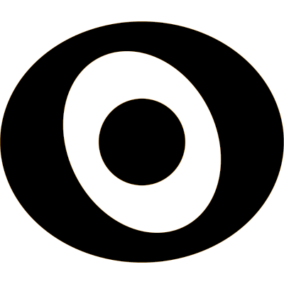

# Uninode 
Uninode is a protocol for global data format definition and sharing.

It is primarily used as part of the Edgescript programming language, but can be 
used for any type of data definition task.

The Uninode classes are structured in a similar manner as Java classes, using domains and packages as
a structure hierarchy.

As a general protocol for organizing and storing information of any type, 
